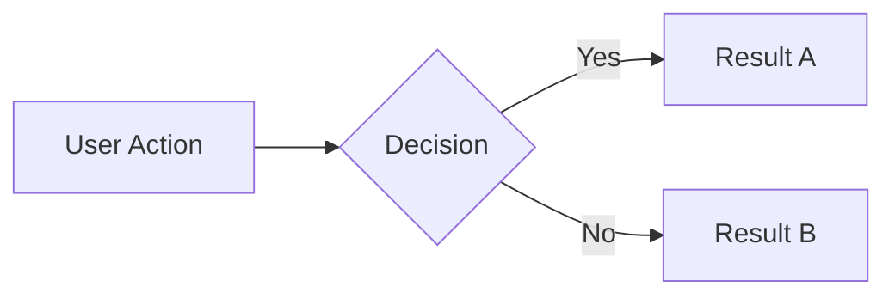
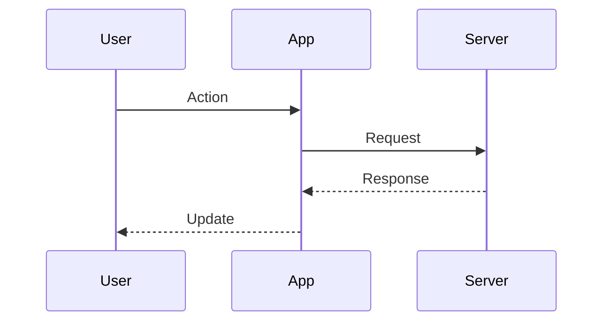
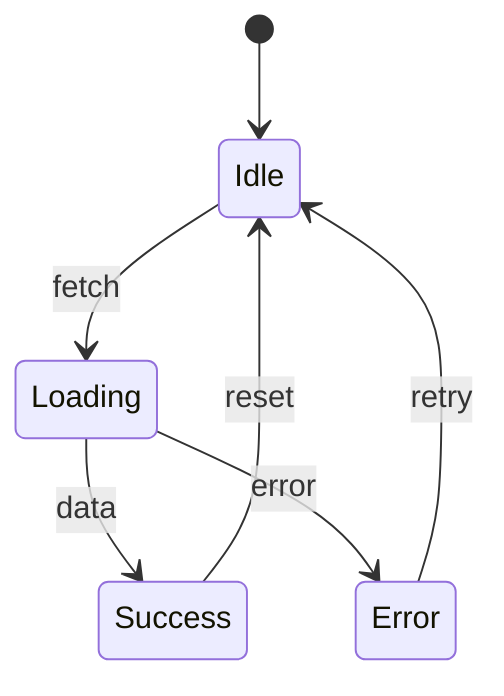

# Documentation Skill

Maintain organized, well-structured project documentation. Prioritizes updating existing docs over creating new ones.

---

## When to Use

- Creating or updating any project documentation
- Before creating a new doc file
- When documenting technical decisions, API flows, or architecture
- Writing changelogs, READMEs, or guides

---

## Core Principles

### 1. Update First, Create Never (Unless Necessary)

**Before creating any new doc:**
1. Search `docs/` for existing related documentation
2. Check if content belongs in an existing file
3. Only create new files for genuinely distinct topics

**Existing docs always beat new docs.**

### 2. Document Metadata Header

Every documentation file MUST include a YAML frontmatter header:

```markdown
---
title: [Document Title]
created: YYYY-MM-DD
author: [Name or "AI-assisted"]
last_updated: YYYY-MM-DD
updated_by: [Name or "AI-assisted"]
status: [draft | active | deprecated]
---
```

**Rules:**
- `created` and `author` are set once, never changed
- `last_updated` and `updated_by` change on every edit
- `status` tracks document lifecycle

### 3. Minimal Document Count

| ✅ Good | ❌ Bad |
|---------|--------|
| One architecture.md with sections | arch-frontend.md, arch-backend.md, arch-db.md |
| Flowcharts in technical-flows.md | auth-flow.md, api-flow.md, ai-flow.md |
| Single CHANGELOG.md | release-notes-v1.md, release-notes-v2.md |

### 4. Standard Doc Structure

```
docs/
├── architecture.md        # Technical patterns & decisions
├── technical-flows.md     # Mermaid diagrams & API flows
├── product-requirements.md  # PRD (if applicable)
├── [topic]-guide.md       # Only for major topics
└── competitive-analysis-[name].md  # Market research
```

**Root-level docs (not in docs/):**
- `README.md` — Project overview
- `CHANGELOG.md` — Version history
- `TASKS.md` — Sprint/backlog
- `CONTRIBUTING.md` — Contribution guide (if open source)

---

## Mermaid Diagram Guidelines

### Flowcharts (LR or TD)



### Sequence Diagrams



### State Diagrams



### Best Practices

1. **Label everything** — Edges and nodes should be self-explanatory
2. **Left-to-right for flows** — Easier to read
3. **Top-down for hierarchies** — Natural reading order
4. **Group related nodes** — Use subgraphs for clarity
5. **Keep it simple** — Max 10-15 nodes per diagram

---

## Updating Documentation Checklist

When updating any doc:

- [ ] Update `last_updated` date in header
- [ ] Update `updated_by` in header  
- [ ] Remove outdated information (don't just add)
- [ ] Verify all links still work
- [ ] Check code samples are current
- [ ] Confirm mermaid diagrams render correctly

---

## Document Discovery

Before creating a new doc, always run:

```bash
# List existing docs
ls -la docs/

# Search for related content
grep -ri "search term" docs/

# Find mermaid diagrams
grep -r "mermaid" docs/
```

---

## Templates

### New Section in Existing Doc

```markdown
---

## [Section Title]

_Added: YYYY-MM-DD_

[Content...]
```

### New Document (only when justified)

```markdown
---
title: [Document Title]
created: YYYY-MM-DD
author: [Name or "AI-assisted"]
last_updated: YYYY-MM-DD
updated_by: [Name or "AI-assisted"]
status: draft
---

# [Title]

[One-line description]

---

## Overview

[Content...]
```

---

## Anti-Patterns

| ❌ Don't | ✅ Do Instead |
|----------|---------------|
| Create auth-flow.md | Add Auth section to technical-flows.md |
| Duplicate content across files | Reference other docs with links |
| Leave stale dates | Update metadata on every edit |
| Create docs for every minor feature | Document in code comments |
| Write docs without checking existing | Always search first |

---

## Changelog Conventions

Follow [Keep a Changelog](https://keepachangelog.com/) format:

```markdown
## [Unreleased]

### Added
- New feature description

### Changed
- Modified behavior

### Fixed
- Bug fix description

### Removed
- Deprecated feature

---

## [1.0.0] - YYYY-MM-DD

### Added
- Initial release features
```

**Categories:** Added, Changed, Deprecated, Removed, Fixed, Security

---

## Quick Reference

| Item | Value |
|------|-------|
| **Metadata required** | title, created, author, last_updated, updated_by, status |
| **Max docs in docs/** | ~5-7 files for typical project |
| **Always update** | last_updated, updated_by on every edit |
| **Mermaid types** | flowchart (LR/TD), sequenceDiagram, stateDiagram-v2, erDiagram |
| **Status values** | draft, active, deprecated |

---

## License

MIT
